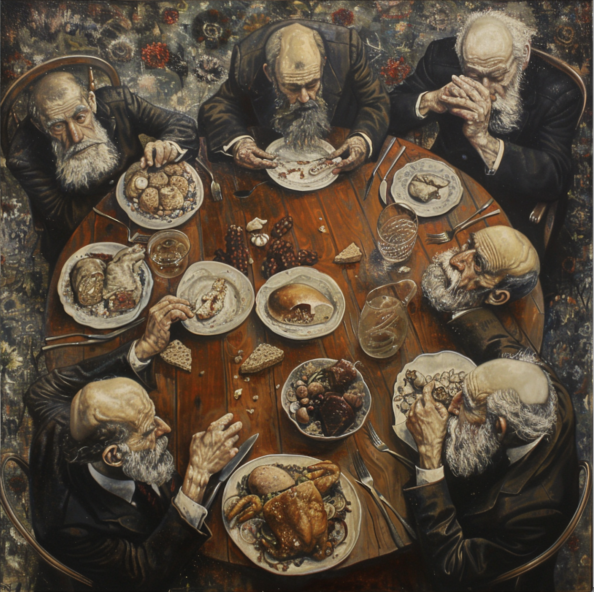

# Dining Philosophers Problem (C Implementation)

## Introduction

Welcome to the Dining Philosophers Problem repository! This project provides a solution to the classic synchronization problem using the C programming language. The problem explores resource allocation and deadlock prevention in concurrent programming scenarios.

## Problem Description

The Dining Philosophers Problem revolves around a dining table with a specific number of philosophers, typically five, seated around it. Each philosopher can be in one of three states: thinking sleeping or eating. To eat, a philosopher needs two chopsticks, one in each hand.

The challenge arises when multiple philosophers attempt to acquire chopsticks simultaneously, potentially leading to deadlock situations. Deadlock occurs when each philosopher holds one chopstick and waits indefinitely for the other, resulting in a standstill where no philosopher can make progress.

The implementation employs C language features, such as threads and mutexes, to control access to chopsticks. Each philosopher follows a protocol to request and release chopsticks, ensuring deadlock avoidance and fair resource allocation.

## Features

- **Threaded Simulation**: Utilizes C threads to simulate concurrent philosopher activities.
- **Mutex Locking**: Ensures mutual exclusion when philosophers request and release chopsticks.
- **Deadlock Prevention**: Implements strategies to avoid deadlock situations during the dining process.
- **Logging and Output**: Provides detailed logging and output to visualize philosopher actions and chopstick usage.

## Build and Run

To build and run the Dining Philosophers simulation, compile the source files using a C compiler:

```bash
git clone https://github.com/abdebennar/Philosophers.git
